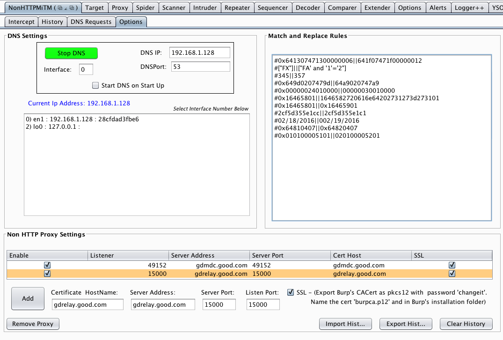
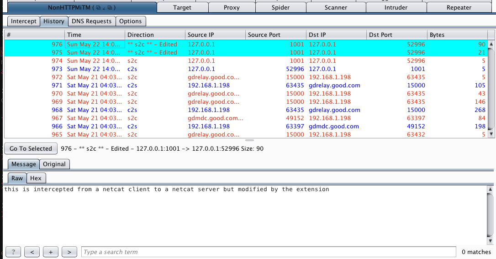

#Burp-Non-HTTP-Extension
This burp extension added two new features to BurpSuite.

 1. A configuratable DNS server. This will route all DNS requests to Burp or another IP. It is an easy way to send mobile or thick client traffic to Burp. You need to create invisible proxy listeners in BurpSuite for the Burp to intercept HTTP traffic or you can use the second feature of this extension to intercept binary protocols.
 1. A Non-HTTP MiTM Intercepting proxy. This extension allows you to create multiple listening ports that can MiTM server side services. It also uses Burp's CA cert so that if the browser or mobile device is already configured to access SSL/TLS requests using this cert then the encrypted binary protocols will be able to connect without generating errors too.
 
##Non-HTTP MiTM proxy

This proxy has several features built in.

 -All requests and responses are saved to a sqlite database and can be exported or imorted into the tool.
 -Automatic Match and replace for Client To Server communications. (Server To Client is not yet supported but is comming soon). Match and replace rules support both hex and string replacement. 
 -Intecept binary protocols and change them before sending them back to the server or client. Just like the normal Burp proxy but with binary streams.
 
###Screenshot of the main options panel.
DNS Setup and proxy listeners

###Screenshot of the DNS History.

###Screenshot of intercepting a netcat server to client connection.

###Screenshot of Modified request in History

